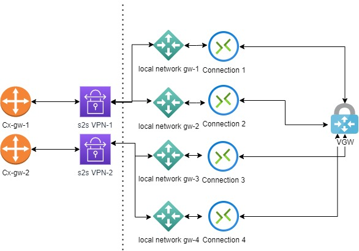

### This is a sample repo to set up HA VPN connection between AWS and Azure
#### Do NOT use this in any ENVIRONMENT(PRD/Dev/Tst/Uat)  without making required changes to sensitive data

## AWS Requirements

| Name                                                    | Version |
| ------------------------------------------------------- | ------- |
|  [aws](#requirement\_aws) | ~> 3.0  |

## Providers

| Name                                              | Version |
| ------------------------------------------------- | ------- |
|  [aws](#provider\_aws) | 3.75.2  |

## Modules

No modules.

## Resources

| Name                                                                                                                                  | Type     |
| ------------------------------------------------------------------------------------------------------------------------------------- | -------- |
| [aws_customer_gateway.customer_gateway](https://registry.terraform.io/providers/hashicorp/aws/latest/docs/resources/customer_gateway) | resource |
| [aws_vpc.vpc](https://registry.terraform.io/providers/hashicorp/aws/latest/docs/resources/vpc)                                        | resource |
| [aws_vpn_connection.main](https://registry.terraform.io/providers/hashicorp/aws/latest/docs/resources/vpn_connection)                 | resource |
| [aws_vpn_gateway.vpn_gateway](https://registry.terraform.io/providers/hashicorp/aws/latest/docs/resources/vpn_gateway)                | resource |

## Inputs

| Name                                                                                                  | Description | Type           | Default                                                                            | Required |
| ----------------------------------------------------------------------------------------------------- | ----------- | -------------- | ---------------------------------------------------------------------------------- | :------: |
|  [public\_ip\_address\_gw](#input\_public\_ip\_address\_gw)  | n/a         | `list(string)` | <pre>[   "" ]</pre>                                                          |    no    |
|  [tunnel1\_inside\_cidr](#input\_tunnel1\_inside\_cidr)       | n/a         | `list`         | <pre>[   "169.254.21.0/30",   "169.254.21.28/30" ]</pre>                  |    no    |
|  [tunnel1\_preshared\_key](#input\_tunnel1\_preshared\_key) | n/a         | `list`         | <pre>[   "fgdytdgdstsgshasgsgsashh",   "fgdytdgdstsgshasgsgsashh" ]</pre> |    no    |
|  [tunnel2\_inside\_cidr](#input\_tunnel2\_inside\_cidr)       | n/a         | `list`         | <pre>[   "169.254.21.4/30",   "169.254.21.32/30" ]</pre>                  |    no    |
|  [tunnel2\_preshared\_key](#input\_tunnel2\_preshared\_key) | n/a         | `list`         | <pre>[   "fgdytdgdstsgshasgsgsashh",   "fgdytdgdstsgshasgsgsashh" ]</pre> |    no    |

## Outputs

No outputs.

## Azure Requirements

| Name                                                                | Version |
| ------------------------------------------------------------------- | ------- |
|  [azurerm](#requirement\_azurerm) | =2.77.0 |

## Providers

| Name                                                          | Version |
| ------------------------------------------------------------- | ------- |
|  [azurerm](#provider\_azurerm) | 2.77.0  |

## Modules

No modules.

## Resources

| Name                                                                                                                                                                           | Type     |
| ------------------------------------------------------------------------------------------------------------------------------------------------------------------------------ | -------- |
| [azurerm_local_network_gateway.localgw](https://registry.terraform.io/providers/hashicorp/azurerm/2.77.0/docs/resources/local_network_gateway)                                 | resource |
| [azurerm_public_ip.example](https://registry.terraform.io/providers/hashicorp/azurerm/2.77.0/docs/resources/public_ip)                                                         | resource |
| [azurerm_resource_group.example](https://registry.terraform.io/providers/hashicorp/azurerm/2.77.0/docs/resources/resource_group)                                               | resource |
| [azurerm_subnet.example](https://registry.terraform.io/providers/hashicorp/azurerm/2.77.0/docs/resources/subnet)                                                               | resource |
| [azurerm_virtual_network.example](https://registry.terraform.io/providers/hashicorp/azurerm/2.77.0/docs/resources/virtual_network)                                             | resource |
| [azurerm_virtual_network_gateway.example](https://registry.terraform.io/providers/hashicorp/azurerm/2.77.0/docs/resources/virtual_network_gateway)                             | resource |
| [azurerm_virtual_network_gateway_connection.az-hub-onprem](https://registry.terraform.io/providers/hashicorp/azurerm/2.77.0/docs/resources/virtual_network_gateway_connection) | resource |

## Inputs

| Name                                                                                                                                    | Description                                                                                                                                                                                                                                          | Type                                                                                                                                | Default                                                                                                                                                                                                                                                                                                                                                                                                                                                                                                                                                                                                                                                                                                                                                                                                                                                                                          | Required |
| --------------------------------------------------------------------------------------------------------------------------------------- | ---------------------------------------------------------------------------------------------------------------------------------------------------------------------------------------------------------------------------------------------------- | ----------------------------------------------------------------------------------------------------------------------------------- | ------------------------------------------------------------------------------------------------------------------------------------------------------------------------------------------------------------------------------------------------------------------------------------------------------------------------------------------------------------------------------------------------------------------------------------------------------------------------------------------------------------------------------------------------------------------------------------------------------------------------------------------------------------------------------------------------------------------------------------------------------------------------------------------------------------------------------------------------------------------------------------------------ | :------: |
|  [client\_id](#input\_client\_id)                                                                         | n/a                                                                                                                                                                                                                                                  | `string`                                                                                                                            | `"add your SP details here"`                                                                                                                                                                                                                                                                                                                                                                                                                                                                                                                                                                                                                                                                                                                                                                                                                                                                     |    no    |
|  [client\_secret](#input\_client\_secret)                                                             | n/a                                                                                                                                                                                                                                                  | `string`                                                                                                                            | `"add your SP details here"`                                                                                                                                                                                                                                                                                                                                                                                                                                                                                                                                                                                                                                                                                                                                                                                                                                                                     |    no    |
|  [express\_route\_circuit\_id](#input\_express\_route\_circuit\_id)                        | The ID of the Express Route Circuit when creating an ExpressRoute connection                                                                                                                                                                         | `any`                                                                                                                               | `null`                                                                                                                                                                                                                                                                                                                                                                                                                                                                                                                                                                                                                                                                                                                                                                                                                                                                                           |    no    |
|  [gateway\_connection\_protocol](#input\_gateway\_connection\_protocol)                 | The IKE protocol version to use. Possible values are IKEv1 and IKEv2. Defaults to IKEv2                                                                                                                                                              | `string`                                                                                                                            | `"IKEv2"`                                                                                                                                                                                                                                                                                                                                                                                                                                                                                                                                                                                                                                                                                                                                                                                                                                                                                        |    no    |
|  [gateway\_connection\_type](#input\_gateway\_connection\_type)                             | The type of connection. Valid options are IPsec (Site-to-Site), ExpressRoute (ExpressRoute), and Vnet2Vnet (VNet-to-VNet)                                                                                                                            | `string`                                                                                                                            | `"IPsec"`                                                                                                                                                                                                                                                                                                                                                                                                                                                                                                                                                                                                                                                                                                                                                                                                                                                                                        |    no    |
|  [local\_bgp\_settings](#input\_local\_bgp\_settings)                                            | Local Network Gateway's BGP speaker settings                                                                                                                                                                                                         | `list(object({ asn_number = number, peering_address = string, peer_weight = number }))`                                             | <pre>[   {     "asn_number": 64512,     "peer_weight": 0,     "peering_address": "169.254.21.1"   },   {     "asn_number": 64512,     "peer_weight": 0,     "peering_address": "169.254.21.5"   },   {     "asn_number": 64512,     "peer_weight": 0,     "peering_address": "169.254.21.29"   },   {     "asn_number": 64512,     "peer_weight": 0,     "peering_address": "169.254.21.33"   } ]</pre>                                                                                                                                                                                                                                                                                                                                                                                                                           |    no    |
|  [local\_networks](#input\_local\_networks)                                                          | n/a                                                                                                                                                                                                                                                  | `list(object({ local_gw_name = string, local_gateway_address = string, local_address_space = list(string), shared_key = string }))` | <pre>[   {     "local_address_space": [       "10.10.0.0/20"     ],     "local_gateway_address": "87.54.43.24",     "local_gw_name": "To-AWS-1",     "shared_key": "fgdytdgdstsgshasgsgsashh"   },   {     "local_address_space": [       "10.10.0.0/20"     ],     "local_gateway_address": "87.54.43.25",     "local_gw_name": "To-AWS-2",     "shared_key": "fgdytdgdstsgshasgsgsashh"   },   {     "local_address_space": [       "10.10.0.0/20"     ],     "local_gateway_address": "87.54.43.26",     "local_gw_name": "To-AWS-3",     "shared_key": "fgdytdgdstsgshasgsgsashh"   },   {     "local_address_space": [       "10.10.0.0/20"     ],     "local_gateway_address": "87.54.43.27",     "local_gw_name": "To-AWS-4",     "shared_key": "fgdytdgdstsgshasgsgsashh"   } ]</pre> |    no    |
|  [local\_networks\_ipsec\_policy](#input\_local\_networks\_ipsec\_policy)               | IPSec policy for local networks. Only a single policy can be defined for a connection.                                                                                                                                                               | `any`                                                                                                                               | `null`                                                                                                                                                                                                                                                                                                                                                                                                                                                                                                                                                                                                                                                                                                                                                                                                                                                                                           |    no    |
|  [peer\_virtual\_network\_gateway\_id](#input\_peer\_virtual\_network\_gateway\_id) | The ID of the peer virtual network gateway when creating a VNet-to-VNet connection                                                                                                                                                                   | `any`                                                                                                                               | `null`                                                                                                                                                                                                                                                                                                                                                                                                                                                                                                                                                                                                                                                                                                                                                                                                                                                                                           |    no    |
|  [subscription\_id](#input\_subscription\_id)                                                       | n/a                                                                                                                                                                                                                                                  | `string`                                                                                                                            | `"add your SP details here"`                                                                                                                                                                                                                                                                                                                                                                                                                                                                                                                                                                                                                                                                                                                                                                                                                                                                     |    no    |
|  [tenant\_id](#input\_tenant\_id)                                                                         | n/a                                                                                                                                                                                                                                                  | `string`                                                                                                                            | `"add your SP details here"`                                                                                                                                                                                                                                                                                                                                                                                                                                                                                                                                                                                                                                                                                                                                                                                                                                                                     |    no    |
|  [vpn\_gw\_sku](#input\_vpn\_gw\_sku)                                                                    | Configuration of the size and capacity of the virtual network gateway. Valid options are Basic, VpnGw1, VpnGw2, VpnGw3, VpnGw4,VpnGw5, VpnGw1AZ, VpnGw2AZ, VpnGw3AZ,VpnGw4AZ and VpnGw5AZ and depend on the type, vpn\_type and generation arguments | `string`                                                                                                                            | `"VpnGw1"`                                                                                                                                                                                                                                                                                                                                                                                                                                                                                                                                                                                                                                                                                                                                                                                                                                                                                       |    no    |

## Outputs

| Name                                                                                                   | Description |
| ------------------------------------------------------------------------------------------------------ | ----------- |
|  [public\_ip\_address\_gw](#output\_public\_ip\_address\_gw) | n/a         |