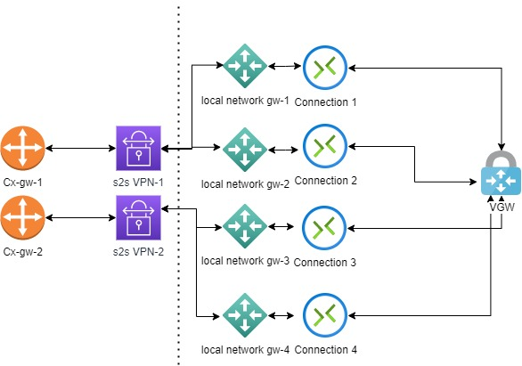

### This is a sample repo to set up HA VPN connection between AWS and Azure
#### Do NOT use this in any ENVIRONMENT(PRD/Dev/Tst/Uat) without making required changes to sensitive data

##### Feel free to provide any suggestions or possible improvements with a PR which can benefit someone trying similar

---

## AWS

### Requirements

| Name                                                    | Version    |
| ------------------------------------------------------- | ---------- |
|  [terraform](#requirement\_terraform) | >= 1.3.0 |
|  [aws](#requirement\_aws) | ~> 5.0     |

### Providers

| Name                                              | Version |
| ------------------------------------------------- | ------- |
|  [aws](#provider\_aws) | ~> 5.0  |

### Modules

No modules.

### Resources

| Name                                                                                                                                  | Type     |
| ------------------------------------------------------------------------------------------------------------------------------------- | -------- |
| [aws_customer_gateway.customer_gateway](https://registry.terraform.io/providers/hashicorp/aws/latest/docs/resources/customer_gateway) | resource |
| [aws_vpc.vpc](https://registry.terraform.io/providers/hashicorp/aws/latest/docs/resources/vpc)                                        | resource |
| [aws_vpn_connection.main](https://registry.terraform.io/providers/hashicorp/aws/latest/docs/resources/vpn_connection)                 | resource |
| [aws_vpn_gateway.vpn_gateway](https://registry.terraform.io/providers/hashicorp/aws/latest/docs/resources/vpn_gateway)                | resource |

### Inputs

| Name | Description | Type | Default | Required |
| ---- | ----------- | ---- | ------- | :------: |
|  [tunnel\_config](#input\_tunnel\_config) | Map of tunnel configurations. Each entry contains the Azure VPN gateway public IP and the two tunnel inside CIDRs and pre-shared keys. | `map(object({ public_ip_address_gw = string, tunnel1_inside_cidr = string, tunnel2_inside_cidr = string, tunnel1_preshared_key = string, tunnel2_preshared_key = string }))` | See `variable.tf` for sample defaults | no |

> **Note:** `tunnel_config` is marked `sensitive = true`. Supply values via a `terraform.tfvars` file or environment variables — never commit secrets to source control.

### Outputs

No outputs.

---

## Azure

### Requirements

| Name                                                    | Version    |
| ------------------------------------------------------- | ---------- |
|  [terraform](#requirement\_terraform) | >= 1.3.0 |
|  [azurerm](#requirement\_azurerm) | ~> 4.0 |

### Providers

| Name                                                          | Version |
| ------------------------------------------------------------- | ------- |
|  [azurerm](#provider\_azurerm) | ~> 4.0  |

### Modules

No modules.

### Resources

| Name                                                                                                                                                                                    | Type     |
| --------------------------------------------------------------------------------------------------------------------------------------------------------------------------------------- | -------- |
| [azurerm_local_network_gateway.localgw](https://registry.terraform.io/providers/hashicorp/azurerm/latest/docs/resources/local_network_gateway)                                          | resource |
| [azurerm_public_ip.this](https://registry.terraform.io/providers/hashicorp/azurerm/latest/docs/resources/public_ip)                                                                     | resource |
| [azurerm_resource_group.this](https://registry.terraform.io/providers/hashicorp/azurerm/latest/docs/resources/resource_group)                                                           | resource |
| [azurerm_subnet.this](https://registry.terraform.io/providers/hashicorp/azurerm/latest/docs/resources/subnet)                                                                           | resource |
| [azurerm_virtual_network.this](https://registry.terraform.io/providers/hashicorp/azurerm/latest/docs/resources/virtual_network)                                                         | resource |
| [azurerm_virtual_network_gateway.this](https://registry.terraform.io/providers/hashicorp/azurerm/latest/docs/resources/virtual_network_gateway)                                         | resource |
| [azurerm_virtual_network_gateway_connection.az-hub-onprem](https://registry.terraform.io/providers/hashicorp/azurerm/latest/docs/resources/virtual_network_gateway_connection)          | resource |

### Inputs

| Name | Description | Type | Default | Sensitive | Required |
| ---- | ----------- | ---- | ------- | :-------: | :------: |
|  [client\_secret](#input\_client\_secret) | Azure service principal client secret | `string` | `"Enter your secret details"` | yes | no |
|  [subscription\_id](#input\_subscription\_id) | Azure subscription ID | `string` | `"Enter your sub details details"` | yes | no |
|  [client\_id](#input\_client\_id) | Azure service principal client ID | `string` | `"Enter your client details"` | yes | no |
|  [tenant\_id](#input\_tenant\_id) | Azure tenant ID | `string` | `"Enter your details"` | yes | no |
|  [local\_networks](#input\_local\_networks) | List of local network gateway configurations. Each entry includes the gateway name, public IP address (from AWS VPN config), address space, pre-shared key, and inline BGP settings (ASN, peering address, peer weight). | `list(object({ local_gw_name = string, local_gateway_address = string, local_address_space = list(string), shared_key = string, asn_number = number, peer_weight = number, peering_address = string }))` | See `variable.tf` for sample defaults | no | no |
|  [gateway\_connection\_type](#input\_gateway\_connection\_type) | The type of connection. Valid options are `IPsec` (Site-to-Site), `ExpressRoute`, and `Vnet2Vnet` | `string` | `"IPsec"` | no | no |
|  [gateway\_connection\_protocol](#input\_gateway\_connection\_protocol) | The IKE protocol version to use. Possible values are `IKEv1` and `IKEv2` | `string` | `"IKEv2"` | no | no |
|  [vpn\_gw\_sku](#input\_vpn\_gw\_sku) | Size and capacity of the virtual network gateway. Valid options: `Basic`, `VpnGw1`–`VpnGw5`, `VpnGw1AZ`–`VpnGw5AZ` | `string` | `"VpnGw1"` | no | no |
|  [local\_networks\_ipsec\_policy](#input\_local\_networks\_ipsec\_policy) | Optional IPSec policy for local network connections. Only a single policy can be defined per connection. Set to `null` to use Azure defaults. See `variable.tf` for valid values per field. | `object({ dh_group = string, ike_encryption = string, ike_integrity = string, ipsec_encryption = string, ipsec_integrity = string, pfs_group = string, sa_datasize = optional(number), sa_lifetime = optional(number) })` | `null` | no | no |
|  [express\_route\_circuit\_id](#input\_express\_route\_circuit\_id) | The ID of the Express Route Circuit when creating an ExpressRoute connection | `string` | `null` | no | no |
|  [peer\_virtual\_network\_gateway\_id](#input\_peer\_virtual\_network\_gateway\_id) | The ID of the peer virtual network gateway when creating a VNet-to-VNet connection | `string` | `null` | no | no |

> **Note:** All four Azure credential variables (`client_secret`, `subscription_id`, `client_id`, `tenant_id`) are marked `sensitive = true`. Supply values via a `terraform.tfvars` file or environment variables — never commit secrets to source control.

### Outputs

| Name | Description |
| ---- | ----------- |
|  [public\_ip\_address\_gw](#output\_public\_ip\_address\_gw) | Public IP addresses of the Azure VPN gateway instances (used to configure the AWS customer gateways) |

<!-- BEGINNING OF PRE-COMMIT-TERRAFORM DOCS HOOK -->

<!-- END OF PRE-COMMIT-TERRAFORM DOCS HOOK -->